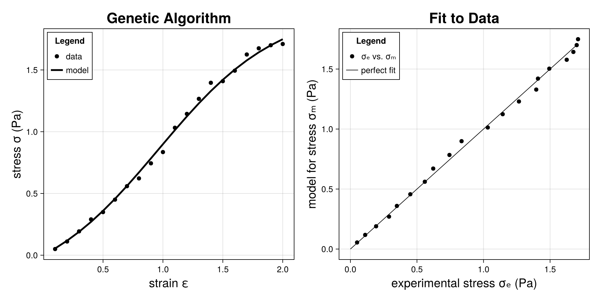

# Genetic Algorithms

Goldberg [1] tells his readers what genetic algorithms (GAs) are, conceptually, in the opening paragraph of his book:

> Genetic algorithms are search algorithms based on the mechanics of natural selection and natural genetics. They combine survival of the fittest among string structures with a structured yet randomized information exchange to form a search algorithm with some of the innovative flair of human search.  In every generation, a new set of artificial creatures (strings) is created using bits and pieces of the fittest of the old; an occasional new part is tried for good measure. While randomized, genetic algorithms are no simple random walk. They efficiently exploit historical information to speculate on new search points with expected improved performance.

GAs have in common a population of individuals, a means to determine the
fitness for each individual within the population, the pairing of individuals
for reproduction according to their fitness, the cross-fertilization of
genetic material from parents to produce offspring, and a random chance of a
mutation occurring in an off-spring's genetic code.  A new generation
replaces the existing one, and the reproduction cycle starts all over again.
This process is repeated to convergence, in a probabalistic sense.

This implementation of a genetic algorithm draws
heavily on the algorithms and Pascal code of Goldberg [1,2].  His books focus on what he calls a
simple genetic algorithm (SGA), which is implemented here. 
Schmitt [4,5] has shown that GAs can be derived
from the principle of maximum entropy governing a Markovian process. Other books that have been written on the subject include, e.g., Michalewicz[3] and Sivanandam and Deepa[6].

GAs are but one of many optimization techniques that exist.  There is a
theorem in the optimization literature called the "no free lunch"
theorem.  It states that the overall performance of any optimization
algorithm, when evaluated over the set of all possible optimization
problems, is no better than any other optimization technique.  An
apparent advantage of one
algorithm over another resides strictly with its application and, quite
often, the personal taste of the user.  It has been this author's
experience that GAs work very well for parameter estimation, particularly for non-linear models.

## Installation

To use this module, you will need to add the following Julia packages to your project:
```
using Pkg
Pkg.add(url = "https://github.com/AlanFreed/PhysicalFields.jl")
Pkg.add(url = "https://github.com/AlanFreed/GeneticAlgorithms.jl")
```
In the code fragments that follow `PF` is used as an alias for `PhysicalFields` and `GA` is used as an alias for `GeneticAlgorithms.`

The models to be considered here for parameterization are physical in the sense that they associate with fields that have physical units, as established in the package `PhysicalFields.`

## Statistics

The objective functions employed herein are norms contrasting an experimental response with a model's prediction of that response. An experimental response is denoted as 

**x** = {*x*₁, *x*₂, …, *x*ₙ}, 

and its corresponding predicted model response is denoted as 

**ξ** = {*ξ*₁, *ξ*₂, …, *ξ*ₙ}, 

where *n* signifies the number of vector entries or datum points obtained from the experiment.

An error can therefore be defined as 

**ϵ** = **x** - **ξ**.

Objective functions are constructed in terms of this error vector.

### Objective functions

A solution is sought that maximizes some objective function. Here that objective function is taken to be

ϕ = 1 / L₁(**ϵ**) + 1 / L₂(**ϵ**) + 1 / L∞(**ϵ**)

where L₁ (1/n) = (1/n)Σᵢ₌₁ⁿ |ϵᵢ| is the L1 distance norm, L₂ = √((1/n) Σᵢ₌₁ⁿ ϵ²ᵢ) is the L2 distance norm, and L∞ = maxᵢ₌₁ⁿ(|ϵᵢ|) is the L∞ distance norm or Chebyshev's distance. Averaging the reciprocal of these three norms provides a versatile measure for fitness with good fitting potential over the span of data.

GAs seek to maximize a quality parameter referred to as *fitness*.  Hence, reciprocal values are used to describe the fitness of objective functions that minimize, and here we are minimizing error.

### Persistence

Most objects created in this package are persistent in that they can be written to a JSON file and then read back in from that JSON file; specifically, package `JSON3.jl` is used for this purpose. 

To open or close an IOStream attached to a JSON file, call
```julia
json_stream = PF.openJSONWriter(<my_dir_path>, <my_file_name.json>)
```
> which opens a `json_stream` of type *IOStream* for a file `<my_file_name.json>` located in directory `<my_dir_path>,` both of which are strings, while
```julia
PF.closeJSONStream(json_stream)
```
> flushes the buffer and closes this `json_stream.`

# A Genetic Algorithm

At the core of this genetic algorithm are haploid genes that can admit two expressions: dominate and recessive. They are represented with a binary value.  At a very low probability of occurrence, a gene may mutate from dominate to recessive, or vice versa, which is taken to occur at conception.

A chromosome is an array of genes assembled as a Gray binary number.  Gray numbers are selected over regular binary numbers so that mutation events have a more refined effect.  Each chromosome represents a model parameter whose optimal value is being sought.  A decoder/encoder pair maps a floating point real into a Gray binary array and back again.  These are one-to-one mappings.  

A genome is a collection of chromosomes, one for each model parameter being sought.  It contains the genetic information of a creature.

A creature is comprised of a genome and a fitness that associates with it, along with a means for their creation. Here there are three:

1. *procreate* is where the genetic information of a creature is assigned randomly.
2. *alien* is where the genetic information of a creature is assigned by the user, viz., their best estimate for what their model's parameters ought to be. This "Adam" creature is introduced into the first generation of its colony.
3. *conceive* is where the genetic information of a child creature comes from the pairing of its two parent creatures.

A colony is a population of creatures, usually numbering in the hundreds.  To evolve a colony from one generation into the next, creatures from the existing generation are picked at random for mate selection via a process known as tournament play.  From two tournaments, a pair of parent creatures gets selected for mating with the outcome being a child creature that will move onto the next generation.  Only the elite creature from an existing population moves onto the next generation.  All other creatures perish at the moment when a new population of children from the current generation become the adults of the next generation.  Mating involves a crossover event with a high probability of occurrence between like pairs of chromosomes from two parents.  During such an event, a pair of chromosomes is split and their genetic information swapped (i.e., a crossover event occurs) which is a probabilistic outcome.  The end result is that a child's chromosome strands are comprised of gene segments from both parents.  

The original generation is procreated.  Every gene is assigned an expression randomly, with 50-50 odds in that generation.  This provides a dispersed population over the window of admissible parametric values, i.e., a Monte Carlo sampling.  To aid in maintaining a diverse population, an immigrant or two may get introduced into a population as contestants for tournament play at the creation of each new generation, which should have a low probability of occurrence.  Mutation also aids in maintaining diversity.  No clones (identical twins) are allowed in this implementation of a genetic algorithm.  Instead of evolving a population of creatures to an existence where all creatures are clones of one another, which is sometimes done in GAs, this implementation of a GA determines its convergence criteria and population size according to formula derived by Goldberg [2] from probability theory.

**Note**: This is a probabilistic solver, so multiple runs of the genetic algorithm will likely produce multiple solutions. These solutions will distribute around the global minimum (and possibly local minima, too, if they exist within the solution space).

## Correlation vs. Causation

It bears repeating a phrase that commonly appears in the optimization literature: 

> *Correlation does not imply causation*. 

In other words, a good model correlation must not be used to infer or suggest the existence of a causal relationship between model and data. I.e., a good correlation does not (cannot) prove that a model is correct; however, a bad correlation can implicate that the model is incorrect.

# Genetic Types

In this implementation of a genetic algorithm there are two genetic constants: dominant and recessive; and four genetic types: a gene, a chromosome, a genome and a creature.

## Genetic Constants

### Dominant

```julia
const dominant = true
```
This constant is used to designate a dominant gene expression, e.g., in the constructor
```julia
my_dominant_gene = Gene(dominant)
```

### Recesive

```julia
const recessive = false
```
This constant is used to designate a recessive gene expression, e.g., in the constructor
```julia
my_recessive_gene = Gene(recessive)
```

## Genes

Genes are the lowest-level containers of genetic information in a genetic algorithm. Here haploid genes are considered. They have two expressions: dominant (assigned as *true*) and recessive (assigned as *false*). 

### Type

Genes are instances of the type
```julia
struct Gene
    expression::PF.MBoolean
end
```
where `MBoolean` is a mutable boolean type, which is required so that a gene can mutate, and thereby change its expression.

### Constructors

There are three Gene constructors:
```julia
gene = Gene()
```
> creates a gene with a random expression.
```julia
gene = Gene(dominant)
```
> creates a gene with a dominant expression.
```julia
gene = Gene(recessive)
```
> creates a gene with a recessive expression.

### Operators

Operators `==` and `≠` have been overloaded so that comparisons can be made between two genes.

### Methods

```julia
expression = get(gene::Gene)
```
> returns the expression held by a gene, i.e., gene.expression.

```julia
set!(gene::Gene, expression::Bool)
```
> assigns a gene expression to field gene.expression.

```julia
cc = copy(gene::Gene)
```
> returns a copy cc of a gene.

```julia
str = toBinaryString(gene::Gene)
```
> returns a string representation str for a gene as either a "0" (recessive) or a "1" (dominant).

```julia
boolean = isDominant(gene::Gene)
```
> returns `boolean = true` if `gene.expression == dominant`.

```julia
boolean = isRecessive(gene::Gene)
```
> returns `boolean = true` if `gene.expression == recessive`.

```julia
mutate!(gene::Gene, probability_mutation::Float64)
```
> Performs a random flip in the field gene.expression at a specified  probability, i.e., from dominant to recessive, or vice versa. This is why a `gene.expression` must be mutable.

To write or read an instance of type *Gene* to or from a JSON file, call
```julia
toFile(gene, json_stream)
```
> which writes a gene of type *Gene* to the JSON file attached to a `json_stream` of type *IOStream*, while
```julia
gene = fromFile(Gene, json_stream)
```
> reads a gene of type *Gene* from the JSON file attached to json_stream.

## Chromosomes

A chromosome is a genetic container of genes. In this implementation of a genetic algorithm, each chromosome represents a parameter (an unknown scalar in some model to be parameterized). Genetic processes (mutation and crossover) adjust these chromosomes through evolutionary processes, and therefore, their associated parametric values change over the generations. Chromosomes are gray binary representations for a model's parameters θ.

Chromosomes are where genetics and optimization meet.

### Type

Chromosomes are instances of the type
```julia
struct Chromosome
    parameter_min::PF.PhysicalScalar
    parameter_max::PF.PhysicalScalar
    genes::Int
    expressions::Int64
    genotype::Vector{Gene}
end
```
where

1. *parameter_min* specifies the minimum scalar value that the phenotype (value of the parameter) can represent, i.e., θₘᵢₙ.
2. *parameter_max* specifies the maximum scalar value that the phenotype can represent, i.e., θₘₐₓ.
3. *genes* specifies the number of genes that comprise a chromosome.
4. *expressions* specifies the number of gene expressions a chromosome can represent.
5. *genotype* provides the genetic material, viz., the genes comprising a chromosome.

> **NOTE**: if `parameter_min ≈ parameter_max` then the phenotype being represented by this chromosome will be taken to be constant, fixed to the value of this collapsed range.

### Constructors

The constructor typically used is
```julia
    chromosome = Chromosome(parameter_min::PF.PhysicalScalar,
                            parameter_max::PF.PhysicalScalar,
                            significant_figures::Int)
```
> where `parameter_min` and `parameter_max` are described above, while `significant_figures` specifies the number of digits in accuracy, in a probabilistic sense, sought by a solution for the model's parameters.

The general constructor called by, e.g., JSON3 is
```julia
    chromosome = Chromosome(parameter_min::PF.PhysicalScalar,
                            parameter_max::PF.PhysicalScalar,
                            genes::Int,
                            expressions::Int64,
                            genotype::Vector{Gene})
```

### Operators

Operators `==` and `≠` have been overloaded so that comparisons can be made between two chromosomes.

### Methods

Get and set indexers are provided.
```julia
gene = getindex(chromosome::Chromosome, index::Int)
```
> returns a gene from a chromosome located at an index, or `gene = chromosome[index]`.

```julia
setindex!(chromosome::Chromosome, gene::Gene, index::Int)
```
> assigns a gene to a chromosome  located at an index, or `chromosome[index] = gene`.

```julia
cc = copy(c::Chromosome)
```
> returns a copy cc of a chromosome.

```julia
str = toBinaryString(chromosome::Chromosome)
```
> returns a string str that describes a chromosome written in a binary format.

```julia
str = toString(chromosome::Chromosome)
```
> returns a string str for the phenotype represented by a chromosome. 

```julia
mutate!(chromosome::Chromosome, probability_mutation::Float64)
```
> performs a random flip in gene expression (i.e., dominant to recessive or vice versa) at a specified probability for mutation applied to each gene in a chromosome.

```julia
C = crossover(A::Chromosome, B::Chromosome, probability_mutation::Float64, probability_crossover::Float64)
```
> performs a crossover at conception between two chromosomes coming from parents A and B with possibilities for individual gene mutation and crossover (chromosome splitting). The result is a child chromosome C.

```julia
θ = decode(chromosome::Chromosome)
```
> returns a phenotype (a model parameter θ, which is an instance of PF.PhysicalScalar) held in the gene expression of a chromosome.

```julia
encode!(chromosome::Chromosome, θ::PF.PhysicalScalar)
```
> assigns a phenotype θ (value of a model parameter) to a chromosome.

To write or read an instance of type *Chromosome* to or from a JSON file, call
```julia
toFile(chromosome, json_stream)
```
> which writes a chromosome of type *Chromosome* to the JSON file attached to a `json_stream` of type *IOStream*, while
```julia
chromosome = fromFile(Chromosome, json_stream)
```
> reads a chromosome of type *Chromosome* from the JSON file attached to `json_stream`.

## Genome

A genome is a genetic container of chromosomes.  A genome represents all parameters in a model being parameterized in terms of their parameters' genetic counterparts.

### Type

Genomes are instances of the type

```julia
struct Genome
    parameters_constrained::Vector{Tuple{Int,Int}}
    genes::Int
    chromosomes::Int
    genotypes::Vector{Chromosome}
end
```
where

1. *parameters_constrained* provides parameter constraints as tuple pairs, e.g., tuple (l, r) imposes a constraint of θ[l] < θ[r].
2. *genes* specifies the number of genes that comprise a genome.
3. *chromosomes* specifies the number of chromosomes that comprise a genome.
4. *genotypes* provides the genetic material, viz., the chromosomes comprising a genome.

### Constructors

Two constructors are provided. The one most likely called by a user is
```julia
genome = Genome(parameters_min::Vector{PF.PhysicalScalar},
                parameters_max::Vector{PF.PhysicalScalar},
                parameters_constrained::Vector{Tuple{Int,Int}}, 
                significant_figures::Int)
```
where

1. *parameters_min* is a vector containing the minimum values for each phenotype (parameter in the model) being parameterized, i.e., θₘᵢₙ[i].
2. *parameters_max* is a vector containing the maximum values for each phenotype in the model being parameterized, i.e., θₘₐₓ[i].
3. *parameters_constrained* is a vector containing constraints between parameters, if any exit. If not, the user should send `parameters_constrained = Vector{Tuple}(undef, 0)` to this constructor.
4. *significant_figures* specifies the number of digits in accuracy, in a probabilistic sense, that is sought by a solution for the model's parameters.

> **NOTE**: if `parameters_min[i] ≈ parameters_max[i]` then the phenotype being represented by the chromosome at index i will be taken to be constant, fixed to the value of this collapsed range.

While the general constructor called, e.g., by JSON3 is
```julia
genome = Genome(parameters_constrained::Vector{Tuple{Int,Int}},
                genes::Int,
                chromosomes::Int, 
                genotypes::Vector{Chromosome})
```

### Operators

Operators `==` and `≠` have been overloaded so that comparisons can be made between two genome.

### Methods

Get and set indexers are provided. 
```julia
chromosome = getindex(genome::Genome, index::Int)
```
> returns a chromosome from a genome at location index, or `chromosome = genome[index]`.

```julia
setindex!(genome::Genome, chromosome::Chromosome, index::Int)
```
> assigns a chromosome to a genome at location index, or `genome[index] = chromosome`.

```julia
cc = copy(genome::Genome)
```
> returns a copy cc of the genome.

```julia
str = toBinaryString(genome::Genome)
```
> returns a string str describing the genome written in a binary format.

```julia
str = toString(genome::Genome)
```
> returns a string str representing the phenotypes expressed by a genome. 

```julia
mutate!(genome::Genome, probability_mutation::Float64)
```
> performs a random flip in gene expression (i.e., dominant to recessive or vice versa) at a specified probability of mutation applied to each gene in the genome.

```julia
C = crossover(A::Genome, B::Genome, probability_mutation::Float64, probability_crossover::Float64)
```
> performs a crossover or conception between two genomes coming from *parents* A and B with a possibility for individual gene mutations and with a likelyhood for crossover (chromosome splitting or sharing between parents).  The result is a *child* genome C.

```julia
θ = decode(genome::Genome)
```
> returns a vector of phenotypes held by the genome. (The parameters θ of a model, which is a vector of physical scalars, possibly with different physical units, i.e., each parameter is an instance of type `Vector{PF.PhysicalScalar}.`)

```julia
encode!(genome::Genome, θ::Vector{PF.PhysicalScalar})
```
> assigns phenotypes (the parameters θ of a model) to a genome.

To write or read an instance of type *Genome* to or from a JSON file, call
```julia
toFile(genome, json_stream)
```
> which writes a genome of type *Genome* to the JSON file attached to a `json_stream` of type *IOStream*, while
```julia
genome = fromFile(Genome, json_stream)
```
> reads a genome of type *Genome* from the JSON file attached to json_stream.

## Creatures
A creature has the genetic material of a genome, plus a means for its origin. After a creature (its object) has been created, it needs to have its genetic material assigned to it. This can occur in one of three ways:

1.  procreation (i.e., randomly assigned),
2. alien (i.e., divinely assigned) or
3. conceived   (i.e., evolving from its parents).

The first generation of a colony is procreated, with a possible exception that their may be an alien (an Adam) assignment. After that, all creatures are created through conception, with a possibility of an immigrant entering into the mating ritual.

### Type

Creatures are instances of type
```julia
struct Creature
    fitness::PF.MReal
    DNA::Genome
end
```
where

1. *fitness* is the value of our objective function, which describes the goodness of fit as a sum of reciprocal distance norms, viz., 1/L₁ + 1/L₂ + 1/L∞, which are norms of the error between experimental response and model prediction.
2. *DNA* holds the genetic information of a creature.


### Constructors

There are three internal constructors and three external constructors for creating creatures.

#### Internal Constructors

```julia
creature = Creature(parameters_min::Vector{PF.PhysicalScalar},
                    parameters_max::Vector{PF.PhysicalScalar},
                    parameters_constrained::Vector{Tuple{Int,Int}}, 
                    significant_figures::Int)
```
```julia
creature = Creature(fitness::Float64, DNA::Genome)
```
```julia
creature = Creature(fitness::PF.MReal, DNA::Genome)
```
where

1. *parameters_min* is a vector containing the minimum scalar values for each phenotype, i.e., each parameter in the model being parameterized, viz., θₘᵢₙ[i].
2. *parameters_max* is a vector containing the maximum scalar values for each phenotype, i.e., each parameter in the model being parameterized, viz., θₘₐₓ[i].
3. *parameters_constrained* is a vector of tuples [(l,r), …] imposing constraints of θ[l] < θ[r], i.e., they are tuples of vector index pairs. If there are no such constraints for your model, then send `parameters_constrained = Vector{Tuple}(undef, 0)` to the constructor.
4. *significant_figures* specifies the number of digits in accuracy, in a probabilistic sense, sought by a solution for the model's parameters.
5. *fitness* is a value of the objective function as it pertains to the creature.
6. *DNA* is the genetic material of a creature.

> **NOTE**: if a `parameters_min[i] ≈ parameters_max[i]` then the phenotype being represented by the chromosome at index i will be taken to be constant, fixed to the value of this collapsed range.

#### External Constructors

These are the constructors used most commonly.

```julia
creature = procreate(parameters_min::Vector{PF.PhysicalScalar},
                     parameters_max::Vector{PF.PhysicalScalar}, 
                     parameters_constrained::Vector{Tuple{Int,Int}}, 
                     significant_figures::Int)
```
> returns a *creature* of type **Creature** whose parameters are assigned at random. Its arguments are discussed above.

```julia
creature = alien(parameters_alien::Vector{PF.PhysicalScalar},
                 parameters_min::Vector{PF.PhysicalScalar},
                 parameters_max::Vector{PF.PhysicalScalar},
                 parameters_constrained::Vector{Tuple{Int,Int}},
                 significant_figures::Int)
```
> returns a *creature* of type **Creature** whose parameters are assigned by the user via vector `parameters_alien.` Its other arguments are discussed above.

```julia
creature = conceive(parentA::Creature, 
                    parentB::Creature,
                    parameters_constrained::Vector{Tuple{Int,Int}},
                    probability_mutation::Float64,
                    probability_crossover::Float64)
```
> returns a *creature* of type **Creature** whose parameters arise from a mating between two parents, viz., *parentA* and *parentB*. Here *probability_mutation* specifies the probability of a gene mutating at conception. This probability is typically quite small. While *probability_crossover* specifies the probability of the parents' chromosomes splitting and pairing at conception; hence, the child will share genes from both of its parents. This probability is typically quite large. Argument *parameters_constrained* is discussed above.

### Operators

Operators `==` and `≠` have been overloaded so that comparisons can be made between two creatures.

### Methods

```julia
cc = copy(creature::Creature)
```
> returns a copy cc of the creature.

```julia
str = toBinaryString(creature::Creature)
```
> returns a string str describing the creature written in a binary format.

```julia
str = toString(c::Creature)
```
> returns a string representation str of the phenotypes held by a creature.

```julia
θ = parameters(creature::Creature)
```
> returns an array of type `Vector{PF.PhysicalScalar}` for the model's parameters θ held in the DNA of this creature.

To write or read an instance of type *Creature* to or from a JSON file, call
```julia
toFile(creature, json_stream)
```
> which writes a creature of type *Creature* to the JSON file attached to a `json_stream` of type *IOStream*, while
```julia
creature = fromFile(Creature, json_stream)
```
> reads a creature of type *Creature* from the JSON file attached to `json_stream`.

# Algorithmic types

In this implementation of a genetic algorithm there are four algorithmic types: the data, a model, a colony and a main, i.e., type GeneticAlgorithm.

## TheData

This data structure, for which the user is responsible, is where the actual data reside that are to be used to fit parameters belonging to the user's model.

### Type

```julia
struct TheData
    experiments::Int
    conjugate_pairs::Vector{Int}
    data_points::Vector{Int}
    # independent variable
    time::Vector{PF.ArrayOfPhysicalScalars}
    # dependent variables
    control::Vector{Vector{PF.ArrayOfPhysicalScalars}}
    response_exp::Vector{Vector{PF.ArrayOfPhysicalScalars}}
    response_mod::Vector{Vector{PF.ArrayOfPhysicalScalars}}
end
```
where

1. *experiments* specifies the number of distinct experiments that were run. For example, one experiment could have been done in 1D, while a second experiment could have been done in 2D.
2. *conjugate_pairs* specify the number of conjuage pairs, i.e., (input, output), (control, response), (cause, effect), … pairings that were monitored per experiment. Thermodynamic examples for conjugate pairs include (temperature, entropy), (pressure, volume), (chemical potential, particle number), etc.
3. *data_points* specify the number of data points recorded per experiment over the conjugate pairs relevant to each experiment.
4. *control* contains scalar valued fields (numbers with physical units) for the control variables belonging to the input of each conjugate pair at each datum point in each experiment that was run. These data will provide inputs to the user's model when it is being solved.
5. *time* is an ordered sequence of moments (the independent variable), one for each datum point in each experiment that was run. If the experiment is (quasi) static, then the user should send `Vector{PF.ArrayOfPhysicalScalars}(undef, 0)` to the constructor.
6. *response_exp* contains scalar valued fields (numbers with physical units) for the experimental response variables (subject to the control variables) belonging to the output of each conjugate pair at each datum point in each experiment run.
7. *response_mod* contains the model's response subject to the control variables. Their values are filled in by the solver whose solution history, for many classes of model, is needed in order to advance a solution. These theoretical data will be contrasted with their experimental counterparts to assess a model's goodness of fit.

Arrays *conjugate_pairs* and *data_points* index as [i], where

> `i ∈ [1, experiments]`.

Array *time* indexes as [i][k], where

> `i ∈ [1, experiments]`, `k ∈ [1, data_points[i]]`.

Arrays *control*, *response_exp* and *response_mod* index as [i][j][k], where

> `i ∈ [1, experiments]`, `j ∈ [1, conjugate_pairs[i]]` and `k ∈ [1, data_points[i]]`, with `[i][j][:]` having the same physical units at each fixed i,j.

### Constructors

The user's constructor.
```julia
data = TheData(experiments::Int,
               conjugate_pairs::Vector{Int},
               data_points::Vector{Int},
               time::Vector{PF.ArrayOfPhysicalScalars},
               control::Vector{Vector{PF.ArrayOfPhysicalScalars}},
               response_exp::Vector{Vector{PF.ArrayOfPhysicalScalars}})
```

The constructor used, e.g., by JSON3.
```julia
data = TheData(experiments::Int,
               conjugate_pairs::Vector{Int},
               data_points::Vector{Int},
               time::Vector{PF.ArrayOfPhysicalScalars},
               control::Vector{Vector{PF.ArrayOfPhysicalScalars}},
               response_exp::Vector{Vector{PF.ArrayOfPhysicalScalars}},
               response_mod::Vector{Vector{PF.ArrayOfPhysicalScalars}})
```

### Operators

Operators `==` and `≠` have been overloaded so that comparisons can be made between two data sets.

### Methods

```julia
cc = copy(data::TheData)
```
> returns a copy cc of the data.

To write or read an instance of type *TheData* to or from a JSON file, call
```julia
toFile(data, json_stream)
```
> which writes the data of type *TheData* to the JSON file attached to a `json_stream` of type *IOStream*, while
```julia
data = fromFile(TheData, json_stream)
```
> reads the data of type *TheData* from the JSON file attached to `json_stream`.

## Model

Here is where the user establishes their own model for parameterization.

### Types

The parent type for all parameter types that are to be supplied to the constructor of type Model is
```julia
abstract type AbstractParameters end
```
whose instances are created by the user for holding the model parameters belonging to their particular model.

A model is a parametric type parameterized over instances of the above abstract type; specifically,
```julia
struct Model{Parameters}
    θ::Parameters
    data::TheData
end
```
where

1. *θ* is an instance of type Parameters, which must be a *mutable* subtype of supertype AbstractParameters. Each parameter in this type is to be a scalar field of type `PF.PhysicalScalar` whose value is mutable but whose physical units are not.
2. *data* is an instance of type TheData, which is where the user supplies their data that are to be fit by this model::Model.

### Methods

Get and set methods are provided such that
```julia
θ = get(model::Model)
```
> returns a vector θ of type `Vector{PF.PhysicalScalar}` that holds the parameters belonging to a model, i.e., `θ = get(model)`.

```julia
θ = getindex(model::Model, index::Int)
```
> returns a scalar θ of type `PF.PhysicalScalar` held in the vector of parameters at location index in the model,  i.e., `θ = model[index]`.

```julia
set!(model::Model, θ::Vector{PF.PhysicalScalar})
```
> assigns a vector of parameters θ to a model, i.e., `model.θ = set!(model, θ)`.

```julia
setindex!(model::Model, θ::PF.PhysicalScalar, index::Int)
```
> assigns a scalar θ to location index in the vector of parameters belonging to a model, i.e., `model.θ[index] = θ`. 

### Solver

```julia
solve!(model::Model) = solve!(model.θ, model)
```
The user must write their own function `solve!(model.θ, model).` The compiler will use multiple dispatch on the type describing model.θ in order to select a correct implementation of solve! at runtime.

This method solves a model using the control data supplied within field model.data.control, and if it is dynamic, using field model.data.time, too, placing the model's predicted response into field model.data.response_mod.

## Colony

A colony is a population of creatures in a genetic algorithm. It is the colony that evolves from one generation to the next, converging towards an optimal state of fitness.

### Type

```julia
struct Colony
    myparameters::AbstractParameters
    mydata::ExperimentalData
    # Fields pertaining to the creatures of a colony.
    probability_mutation::Float64
    probability_crossover::Float64
    probability_immigrant::Float64
    parameters_min::Vector{PF.PhysicalScalar}
    parameters_max::Vector{PF.PhysicalScalar}
    parameters_constrained::Vector{Tuple{Int,Int}}
    significant_figures::Int
    # Fields pertaining to the colony itself.
    population::Int
    generations::Int
    elite::Creature
    # Mutable fields pertaining to the colony itself.
    generation::PF.MInteger
    children::Vector{Creature}
    adults::Vector{Creature}
end
```

### Constructors

The constructor most likely to be called by a user is

```julia
colony = Colony(myparameters::AbstractParameters,
                mydata::TheData, 
                # Fields pertaining to the creatures of a colony.
                probability_mutation::Float64, 
                probability_crossover::Float64, 
                probability_immigrant::Float64,
                parameters_alien::Vector{PF.PhysicalScalar},
                parameters_min::Vector{PF.PhysicalScalar},
                parameters_max::Vector{PF.PhysicalScalar}, 
                parameters_constrained::Vector{Tuple{Int,Int}}, 
                significant_figures::Int)
```
where

1. *myparameters* is an object holding the model's parameters θ whose supertype is AbstractParameters. What is needed by this constructor is the object itself, i.e., its fields for meta programming, not the actual values held by these fields.
2. *mydata* holds the experimental data that the model is to be fit against, whose optimal parameters θ are sought, plus it is a container for the model's predictions, too.
3. *probability_mutation* is the probability of a gene mutation occurring at conception, i.e., a gene swapping its expression. Typically this is at a low value, e.g., < 0.05.
4. *probability_crossover* is the probability of a crossover event occurring at conception, i.e., the splitting and pairing of chromosomes coming from two parents. Typically this is at a large value, e.g., > 0.95.
5. *probability_immigrant* is the probability of introducing an immigrant into tournament play (mate selection) after the first generation. This diversity helps the genetic algorithm's search grid from focusing in on a possible solution that is locally optimal over the parameter space, but maybe not globally optimal.
6. *parameters_alien* is the user's best guess for parameters θ. If the user doesn't have a best guess, then the user should send `parameters_alien = Vector{PF.PhysicalScalar}(undef, 0)` to the constructor.
7. *parameters_min* are lower bounds for the parameters θ being sought.
8. *parameters_max* are upper bounds for the parameters θ being sought.
9. *parameters_constrained* are tuples of indices (left, right) that impose an inequality constraint, viz.: `θ[left] < θ[right]`. If there are no constraints, then the user should send `parameters_constrained = Vector{Tuples}(undef, 0)` to the constructor.
10. *significant_figures* is the number of significant figures of accuracy sought in a final solution for the parameters in a probabilistic sense. There is a strong correlation between this value and how long it takes to get a solution. Values of 4 or 5 are common. They are bound to the interval [1…8].

> If a minimum parameter equals its maximum parameter at any given index in the sense that `parameters_min[i] ≈ parameters_max[i]` at say index i, then that model parameter, i.e., θ[i], will be taken to be fixed at its specified value.

The full constructor (used by JSON3) is
```julia
colony = Colony(myparameters::AbstractParameters,
                mydata::TheData,
                # Fields pertaining to the creatures of a colony.
                probability_mutation::Float64,
                probability_crossover::Float64,
                probability_immigrant::Float64,
                parameters_min::Vector{PF.PhysicalScalar},
                parameters_max::Vector{PF.PhysicalScalar},
                parameters_constrained::Vector{Tuple{Int,Int}},
                significant_figures::Int,
                # Fields pertaining to the colony itself.
                population::Int,
                generations::Int,
                elite::Creature,
                # Mutable fields pertaining to the colony itself.
                generation::PF.MInteger,
                children::Vector{Creature},
                adults::Vector{Creature})
```
whose arguments, in addition to those of the first constructor, include:

1. *population* establishes how many creatures comprise the colony. This is fixed from one generation to the next, and is established through a formula derived from probability theory by D. Goldberg (2002) in the other constructor.
2. *generations* specifies the number of generations estimated to achieve a convergence for the parameters sought, in a statistical sense. This is established through a formula derived from probability theory by D. Goldberg (2002) in the other constructor.
3. *elite* is the most fit creature in the population at its current generation.
4. *generation* is a counter representing the current generation along a solution path that will end when `generation == generations`.
5. *children* is a vector holding the newly conceived creatures of a generation that are to become the adults of the next generation.
6. *adults* is a vector of creatures comprising the current generation, and who can mate.

### Methods

```julia
advance!(colony::Colony)
```
> increments a solution along its path, advancing it by one generation.

```julia
text = report(colony::Colony)
```
> returns a human-readable report via a string *text* that describes the health of the current generation through a slate of statistics. This is written to directory *files*, which is a subdirectory to the directory that the user is executing their code in.

To write or read an instance of type *Colony* to or from a JSON file, call
```julia
toFile(colony, json_stream)
```
> which writes a colony of type *Colony* to the JSON file attached to a `json_stream` of type *IOStream*, while
```julia
colony = fromFile(Colony, json_stream)
```
> reads a colony of type *Colony* from the JSON file attached to `json_stream`.

## GeneticAlgorithm

Genetic algorithms are procedures whereby one can parameterize a model against data. Genetic algorithms are probabilistic, in contrast with gradient methods that are deterministic.

This is the highest-level type belonging to package *GeneticAlgorithms*. 

### Type

```Julia
struct GeneticAlgorithm
    colony::Colony
end
```
where a `colony` is a population of creatures that evolves from one generation to the next.

### Constructor

```Julia
genetic_algorithm = GeneticAlgorithm(colony)
```

### Methods

```Julia
run!(genetic_algorithm::GeneticAlgorithm; verbose::Bool = true)
```
Function `run!` calls a solver for the *genetic_algorithm* whose population size and number of generations to advance through are determined internally. A report is written to file for the user to read. If keyword `verbose` is *true*, the default, then a page in this report is written for each generation of the colony; otherwise, the report only contains information pertaining to the initial and final generations.

To write or read an instance of type *GeneticAlgorithm* to or from a JSON file, call
```julia
toFile(genetic_algorithm, json_stream)
```
> which writes a genetic_algorithm of type *GeneticAlgorithm* to the JSON file attached to a `json_stream` of type *IOStream*, while
```julia
genetic_algorithm = fromFile(GeneticAlgorithm, json_stream)
```
> reads a genetic_algorithm of type *GeneticAlgorithm* from the JSON file attached to `json_stream.

# Examples

## A Template

First, write a function 
```julia
function myData()::GA.TheData
``` 
that holds your experimental data. For example, `mydata = myData()` returned as an instance of type `GA.TheData.`

Second, create a type that holds your model's parameters, viz.,
```julia
mutable struct MyParameters <: AbstractParameters
    # Enter parameters as instances of type `PF.PhysicalScalar`,
    # where the value of each scalar is mutable, but its units are not.
    …
end
```
which must be a mutable data structure so as to allow the solver to assign its values at runtime.

Now, using your data (function `mydata = myData()`) and your model parameters (constructor `myparameters = MyParameters()`), create your model by writing
```julia
mymodel = GA.Model{MyParameters}(myparameters::MyParameters, mydata::GA.TheData)
```

At this point, one must write a solver for their model, whose interface should be
```julia
GA.solve!(::MyParameters, mymodel::GA.Model)
```
> with the solution being placed into field `mymodel.data.response_mod.`

This solver could have a structure like:
```julia
function GA.solve!(::MyParameters, mymodel::GA.Model)
    # Type MyParameters allows Julia to select solve! via multiple dispatch.
    for exp in 1:mymodel.data.experiments
        for pair in 1:mymodel.data.conjugate_pairs[exp]
            for datum in 1:mymodel.data.data_points[exp]
                y = _mysolve(mymodel; exp, pair, datum)
                mymodel.data.response_mod[exp][pair][datum] = y
            end
        end
    end
    return nothing
end
```
> where it is important that one creates the function `GA.solve!,` not the function `solve!.`

The above solver calls a model specific solver, viz.,
```julia
function _mysolver(mymodel::GA.Model; 
                   exp::Int, pair::Int, datum::Int)::PF.PhysicalScalar
    # Write your solver for 
    #    y = f(mymodel; exp, pair, datum)
    # where f is what you're writing here, which may solve a function, 
    # a differential equation, an integral equation, etc., given arguments:
    # 1. mymodel is the user's model,
    # 2. exp denotes the experiment,
    # 3. pair denotes the conjugate pair of this experiment, and
    # 4. datum specifies the data point along its solution path.
    # With this information, the user can write a solver that solves for
    # 5. y is the response or output predicted by the model.
    # A model is said to be static if it does not depend upon time; 
    # otherwise, the model is said to be dynamic, with time being
    # stored in the field: mymodel.data.time.
    y = …
    return y
end # _mysolver
```
This function will vary in complexity depending on the kind of model being solved. Efficient solvers should be used, as this is where the bulk of the time will be spent by the genetic algorithm solver.

See the examples as illustrations of how to use this template.

## Example 1

The model for the first example is
```julia
σ = E sinh(aε) / (a cosh(aε) - b sinh(aε))
```
which is a 1D stress σ strain ε model that describes sigmoidal behavior, where E (>0) is a modulus with units of stress, while a and b are dimensionless parameters constrained so that b > a > 0. A typical fitting of this model to data is visible in the figure below (if your viewer is HTML enabled).

<figure>
	
	<figcaption>A fitting of model parameters for example 1, with the fit parameters being: <br/>
a = 1.00030, b = 0.74755 and E = 0.50882 kg/(m⋅s²).</figcaption>
</figure>
This solution space has multiple local minima, any of which the solver may converge on, so you will likely want to run the genetic algorithm several times to find the *best* one.

### The Executable Module

```julia
module example1

# To use this code, you will need to download the genetic algorithm at:
# using Pkg
# Pkg.add(url = "https://github.com/AlanFreed/PhysicalFields.jl")
# Pkg.add(url = "https://github.com/AlanFreed/GeneticAlgorithms.jl")

using
    CairoMakie,
    GeneticAlgorithms,
    PhysicalFields

import
    GeneticAlgorithms as GA,
    PhysicalFields    as PF

export
    run

# Enter the code fragments listed below.
…
end # example1
```


### Create Your Data

If your data set is large, you may want to load it via a file, etc. Here it is small enough to just install it manually.

```julia
function myData()::GA.TheData
    n_exp = 1
    pairs = 1
    n_pts = 20
    experiments     = n_exp
    conjugate_pairs = Vector{Int}(undef, n_exp)
    data_points     = Vector{Int}(undef, n_exp)
    for exp in 1:n_exp
        conjugate_pairs[exp] = pairs
        data_points[exp]     = n_pts
    end
    time     = Vector{PF.ArrayOfPhysicalScalars}(undef, 0) # a static model
    control  = Vector{Vector{PF.ArrayOfPhysicalScalars}}(undef, n_exp)
    response = Vector{Vector{PF.ArrayOfPhysicalScalars}}(undef, n_exp)
    for exp in 1:n_exp
        control[exp]  = Vector{PF.ArrayOfPhysicalScalars}(undef, pairs)
        response[exp] = Vector{PF.ArrayOfPhysicalScalars}(undef, pairs)
        for pair in 1:pairs
            control[exp][pair]  = PF.ArrayOfPhysicalScalars(n_pts, PF.STRAIN)
            response[exp][pair] = PF.ArrayOfPhysicalScalars(n_pts, PF.STRESS)
        end
    end
    control[1][1][1]  = PF.PhysicalScalar(0.1, PF.STRAIN)
    control[1][1][2]  = PF.PhysicalScalar(0.2, PF.STRAIN)
    control[1][1][3]  = PF.PhysicalScalar(0.3, PF.STRAIN)
    control[1][1][4]  = PF.PhysicalScalar(0.4, PF.STRAIN)
    control[1][1][5]  = PF.PhysicalScalar(0.5, PF.STRAIN)
    control[1][1][6]  = PF.PhysicalScalar(0.6, PF.STRAIN)
    control[1][1][7]  = PF.PhysicalScalar(0.7, PF.STRAIN)
    control[1][1][8]  = PF.PhysicalScalar(0.8, PF.STRAIN)
    control[1][1][9]  = PF.PhysicalScalar(0.9, PF.STRAIN)
    control[1][1][10] = PF.PhysicalScalar(1.0, PF.STRAIN)
    control[1][1][11] = PF.PhysicalScalar(1.1, PF.STRAIN)
    control[1][1][12] = PF.PhysicalScalar(1.2, PF.STRAIN)
    control[1][1][13] = PF.PhysicalScalar(1.3, PF.STRAIN)
    control[1][1][14] = PF.PhysicalScalar(1.4, PF.STRAIN)
    control[1][1][15] = PF.PhysicalScalar(1.5, PF.STRAIN)
    control[1][1][16] = PF.PhysicalScalar(1.6, PF.STRAIN)
    control[1][1][17] = PF.PhysicalScalar(1.7, PF.STRAIN)
    control[1][1][18] = PF.PhysicalScalar(1.8, PF.STRAIN)
    control[1][1][19] = PF.PhysicalScalar(1.9, PF.STRAIN)
    control[1][1][20] = PF.PhysicalScalar(2.0, PF.STRAIN)
    
    response[1][1][1]  = PF.PhysicalScalar(0.050, PF.STRESS)
    response[1][1][2]  = PF.PhysicalScalar(0.111, PF.STRESS)
    response[1][1][3]  = PF.PhysicalScalar(0.193, PF.STRESS)
    response[1][1][4]  = PF.PhysicalScalar(0.290, PF.STRESS)
    response[1][1][5]  = PF.PhysicalScalar(0.349, PF.STRESS)
    response[1][1][6]  = PF.PhysicalScalar(0.450, PF.STRESS)
    response[1][1][7]  = PF.PhysicalScalar(0.559, PF.STRESS)
    response[1][1][8]  = PF.PhysicalScalar(0.622, PF.STRESS)
    response[1][1][9]  = PF.PhysicalScalar(0.744, PF.STRESS)
    response[1][1][10] = PF.PhysicalScalar(0.835, PF.STRESS)
    response[1][1][11] = PF.PhysicalScalar(1.032, PF.STRESS)
    response[1][1][12] = PF.PhysicalScalar(1.144, PF.STRESS)
    response[1][1][13] = PF.PhysicalScalar(1.266, PF.STRESS)
    response[1][1][14] = PF.PhysicalScalar(1.396, PF.STRESS)
    response[1][1][15] = PF.PhysicalScalar(1.409, PF.STRESS)
    response[1][1][16] = PF.PhysicalScalar(1.494, PF.STRESS)
    response[1][1][17] = PF.PhysicalScalar(1.625, PF.STRESS)
    response[1][1][18] = PF.PhysicalScalar(1.675, PF.STRESS)
    response[1][1][19] = PF.PhysicalScalar(1.700, PF.STRESS)
    response[1][1][20] = PF.PhysicalScalar(1.710, PF.STRESS)
    
    return GA.TheData(experiments, conjugate_pairs, data_points, 
                      time, control, response)
end # myData
```

### Create Your Parameters

```julia
mutable struct MyParameters <: GA.AbstractParameters
    a::PF.PhysicalScalar
    b::PF.PhysicalScalar
    E::PF.PhysicalScalar
    # the constructor
    function MyParameters()
        a = PF.PhysicalScalar(PF.DIMENSIONLESS)
        b = PF.PhysicalScalar(PF.DIMENSIONLESS)
        E = PF.PhysicalScalar(PF.MODULUS)
        new(a, b, E)::MyParameters
    end
end # MyParameters
```

### Create Your Model

```julia
myparameters = MyParameters()
mydata  = myData()
mymodel = GA.Model{MyParameters}(myparameters::MyParameters,
                                 mydata::GA.TheData)
```

### Write Your Solver

```julia
function GA.solve!(::MyParameters, mymodel::GA.Model)
    # Type MyParameters allows Julia to select solve! via multiple dispatch.
    for exp in 1:mymodel.data.experiments
        for pair in 1:mymodel.data.conjugate_pairs[exp]
            for datum in 1:mymodel.data.data_points[exp]
                y = _mysolve(mymodel; exp, pair, datum)
                mymodel.data.response_mod[exp][pair][datum] = y
            end
        end
    end
    return nothing
end # GA.solve!
```
which calls the model's solver
```julia
function _mysolve(mymodel::GA.Model;
                  exp::Int, pair::Int, datum::Int)::PF.PhysicalScalar
    # Example of a static model described by a simple function, i.e., σ = f(ε).
    ε = mymodel.data.control[exp][pair][datum]
    θ = mymodel.θ
    σ = θ.E * sinh(θ.a*ε) / (θ.a * cosh(θ.a*ε) - θ.b * sinh(θ.a*ε))
    return σ
end # _mysolve
```
which is straightforward here because the model is just a simple function.

### Create a Figure

This is optional. It provides an immediate visual feedback as to the goodness of fit.

```julia
function plot(colony::Colony)
    # Create a figure illustrating a best fit of the model.
    εₑ = Vector{Float64}
    σₑ = Vector{Float64}
    σₘ = Vector{Float64}
    for exp in 1:colony.mydata.experiments
        εₑ = zeros(Float64, colony.mydata.data_points[exp])
        σₑ = zeros(Float64, colony.mydata.data_points[exp])
        σₘ = zeros(Float64, colony.mydata.data_points[exp])
        for pair in 1:colony.mydata.conjugate_pairs[exp]
            for datum in 1:colony.mydata.data_points[exp]
                εₑ[datum] = PF.get(colony.mydata.control[exp][pair][datum])
                σₑ[datum] = PF.get(colony.mydata.response_exp[exp][pair][datum])
                σₘ[datum] = PF.get(colony.mydata.response_mod[exp][pair][datum])
            end
        end
    end
    
    σᵢ    = zeros(Float64, 2)
    σᵢ[2] = PF.get(colony.mydata.response_exp[1][1][colony.mydata.data_points[1]])
    
    fig = Figure(; size = (1000, 500))
    ax1 = Axis(fig[1, 1];
        xlabel = "strain ε",
        ylabel = "stress σ (Pa)",
        title = "Genetic Algorithm",
        titlesize = 24,
        xlabelsize = 20,
        ylabelsize = 20)
    scatter!(ax1, εₑ, σₑ;
        marker = :circle,
        markersize = 10,
        color = :black,
        label = "data")
    lines!(ax1, εₑ, σₘ;
        linewidth = 3,
        linestyle = :solid,
        color = :black,
        label = "model")
    axislegend("Legend",
        position = :lt)
    ax2 = Axis(fig[1, 2];
        xlabel = "experimental stress σₑ (Pa)",
        ylabel = "model for stress σₘ (Pa)",
        title = "Fit to Data",
        titlesize = 24,
        xlabelsize = 20,
        ylabelsize = 20)
    scatter!(ax2, σₑ, σₘ;
        marker = :circle,
        markersize = 10,
        color = :black,
        label = "σₑ vs. σₘ")
    lines!(ax2, σᵢ, σᵢ;
        linewidth = 1,
        linestyle = :solid,
        color = :black,
        label = "perfect fit")
    axislegend("Legend",
        position = :lt)
    save(string(pwd(), "/files/GA_example1.png"), fig)
end # plot
```

### Write a Script to Execute

```julia

function run()
    # Specify it the report is to be verbose or not.
    verbose = false

    # Enter properties pertinent to the colony.
    myparameters           = MyParameters()
    mydata                 = myData()
    probability_mutation   = 0.01 
    probability_crossover  = 0.95
    probability_immigrant  = 0.005
    parameters_alien       = Vector{PF.PhysicalScalar}(undef, 0)    # no alien
    parameters_min         = Vector{PF.PhysicalScalar}(undef, 3)
    parameters_max         = Vector{PF.PhysicalScalar}(undef, 3)
    parameters_constrained = Vector{Tuple{Int,Int}}(undef, 1) 
    significant_figures    = 5

    # Populate parameter bounds and constraints.
    parameters_min[1] = PF.PhysicalScalar(0.1, PF.DIMENSIONLESS)
    parameters_min[2] = PF.PhysicalScalar(0.1, PF.DIMENSIONLESS)
    parameters_min[3] = PF.PhysicalScalar(0.1, PF.MODULUS)

    parameters_max[1] = PF.PhysicalScalar(1.5, PF.DIMENSIONLESS)
    parameters_max[2] = PF.PhysicalScalar(1.5, PF.DIMENSIONLESS)
    parameters_max[3] = PF.PhysicalScalar(1.5, PF.MODULUS)

    parameters_constrained[1] = (2, 1)  # 0 < a < b
    
    # Create the colony and its genetic algorithm.
    colony = GA.Colony(myparameters, mydata, probability_mutation,
                       probability_crossover, probability_immigrant,
                       parameters_alien, parameters_min, parameters_max,
                       parameters_constrained, significant_figures)

    genetic_algorithm = GA.GeneticAlgorithm(colony)
    GA.run!(genetic_algorithm; verbose)
    plot(genetic_algorithm.colony)
end # run
```

### A Typical Report (translated to markdown)

For generation 1 of 52:

Fitness statistics for generation 1 with a population size of 116:

    optimum fitness  2.21132E+01,
    median           4.66315,
    arithmetic mean  5.73607,
    std deviation    4.26777,
    skewness         1.33068,
    excess kurtosis  1.95835.

The genome from the most fit creature:

1. 1111110011111010110000100101011111100000
2. 0101100111001100000110001011100000011011
3. 0101011010111101011101110010010101000101

Lists for [parameter_min, parameter_best, parameter_max]:

1. a ∈ [0.10000, 1.02244, 1.50000] 
2. b ∈ [0.10000, 0.70447, 1.50000] 
3. E ∈ [0.10000, 0.65145, 1.50000] kg/(m⋅s²)

Values for best parameter ± error, where a RMSE was computed wrt best values. Data were the parameters from all 116 adults living in generation 1.

1. a = 1.02244 ± 0.31562
2. b = 0.70447 ± 0.33823
3. E = 0.65145 ± 0.44040 kg/(m⋅s²)

For generation 52 of 52:

Fitness statistics for generation 52 with a population size of 116:

    optimum fitness  8.79553E+01,
    median           8.78021E+01,
    arithmetic mean  7.78090E+01, 
    std deviation    2.50535E+01,
    skewness        -2.29031,
    excess kurtosis  3.49048. 

To aid in assessing goodness of fit, a suite of correlation coefficients
between experimental response and model prediction are provided.

    Pearson's linear correlation coefficient:
      r = 0.99849,
    Spearman's monotonic correlation coefficient:
      ρ = 1.00000,
    Kendall's monotonic correlation coefficient:
      τ = 1.00000,
    and Chatterjee's nonlinear correlation coefficient:
      ξ = 0.85714.

The genome from the most fit creature:

1. 1111011011110000000100110001101101110010
2. 0100110101011100101111110101001101010010
3. 0110111110100001111100101101010011001000

Lists for [parameter_min, parameter_best, parameter_max]:

1. a ∈ [0.10000, 1.00030, 1.50000] 
2. b ∈ [0.10000, 0.74755, 1.50000] 
3. E ∈ [0.10000, 0.50882, 1.50000] kg/(m⋅s²)

Values for best parameter ± error, where a RMSE was computed wrt best values. Data were the parameters from all 116 adults living in generation 52.

1. a = 1.00030 ± 0.04458
2. b = 0.74755 ± 0.02383
3. E = 0.50882 ± 0.08596 kg/(m⋅s²)

# References

	1. Goldberg, D.E., Genetic Algorithms in Search, Optimization, and Machine Learning, Addison-Wesley, Boston, 1989.
    2. Goldberg, D.E., The Design of Innovation: Lessons learned from and for competent genetic algorithms, 2002.  In: Genetic algorithms and evolutionary computation, Vol. 7, Klewer, Boston, 2002.
    3. Michalewicz, Z., Genetic Algorithms + Data Structures = Evolution Programs, 3rd ed., Springer, Berlin, 1996.
    4. Schmitt, L.M., "Theory of genetic algorithms", Theoretical Computer Science, Vol. 259 (2001) pp. 1-61.
    5. Schmitt, L.M., "Theory of genetic algorithms II: Models for genetic operators over the string-tensor representation of populations and convergence to global optima for arbitrary fitness function under scaling", Theoretical Computer Science, Vol. 310 (2004) pp. 181-231.
    6. Sivanandam, S.N. and Deepa, S.N., Introduction to Genetic Algorithms, Springer, Berlin, 2008.
 
## About the Author

This Julia module evolved from software written to support lectures on numerical methods given by the author (Alan Freed) to his undergraduate students at both Saginaw Valley State University (SVSU, 2007-2014) and Texas A&M University (TAMU, 2014-2021). He taught the programming language Zonnon at SVSU (a Pascal-like language written for .NET) and Python at TAMU. The author started programming in Julia at the time when he accepted a Joint Faculty Appointment (JFA) with the U.S. Army Research Lab (ARL) at Aberdeen, MD in 2019. Since his retirement from TAMU in 2021, he has been a member of the Volunteer Emeritus Corp (VEC) at ARL.

Julia is the best language that he has programmed in over his career.

# Version History

## Version 1.0.0

First version made publicly available on GitHub. From a Julia prompt, execute

`Pkg.add(url = "https://github.com/AlanFreed/GeneticAlgorithms.jl")`
    
## Version 0.1.2

Bug fixes and polishing the code and its algorithm.

## Version 0.1.1

A complete rewrite focusing on the use of multiple dispatch in lieu of object-oriented coding.

## Version 0.1.0

The original version of this Julia code, dated June 2024. It was a port from the author's prior codes written in Zonnon, Pascal and Python for classes that he taught in numerical methods to mechanical engineers when he was a professor at SVSU (2007-2014) and TAMU (2014-2021).
